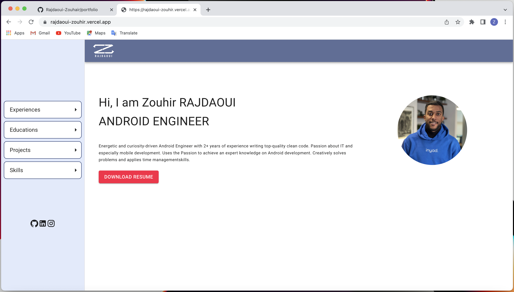
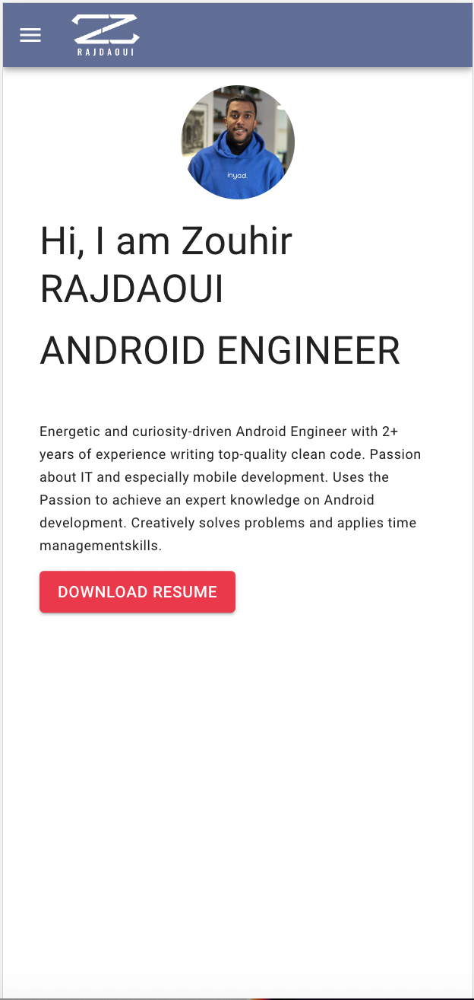

# Portfolio Usin Next.js

  
   

 

## 📝 About 
I have developed this project when i was learning Next.js framework
the idea is to develop an easy and super fast single page application.
It covers Next.js features such as:
- Pages
- Styles
- External libraries (Material Ui, Styled components)
- Routing and dynamic Routing using Next/Link and UseRouter hook
- etc...

### 🔨 Stack
- Next.js
- Material Ui
- Styled Components
- Vercel 

### 🚧 TODO
- [x] About, Experiences, Educations, Projects and Skills pages UI
- [x] About, Experiences, Educations, Projects and Skills pages Data
- [x] Make data customizable
- [x] Add projects Images
- [x] Deploy first version to vercel
- [ ] Improve Pages UI and UX
- [ ] Add dark mode support
- [ ] Deploy stable version to zouhir-rajdaoui.com

### 🚧 Make it yours
if you like this portfolio template you can make it yours in three steps:
- clone the repo
- go to public/data/constants.js and replace the content with your informations
- run project locally (npm/yarn install => npm run/yarn dev) then build and deploy to your domain(vercel is the easiest way)

## live link 
[@version1](https://rajdaoui-zouhir.vercel.app)

